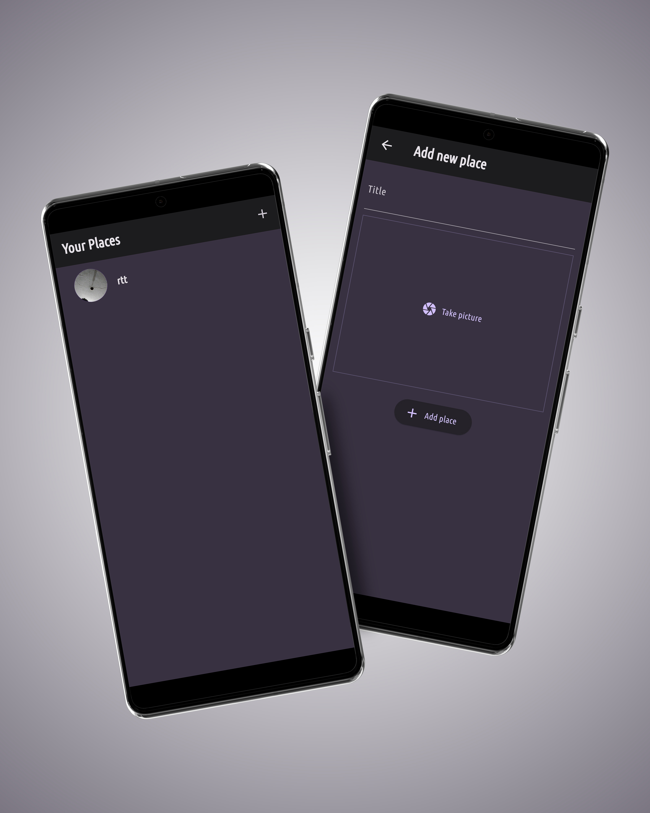

# Favorite Places App

A Flutter-based application that allows users to add and view their favorite places with a title and an image. The app uses Firebase for backend services.

## My Screens:

## Features

- **Add Favorite Places**: Users can add a new favorite place by providing a title and an image.
- **View Favorite Places**: The main page displays a list of all favorite places with their titles and images.